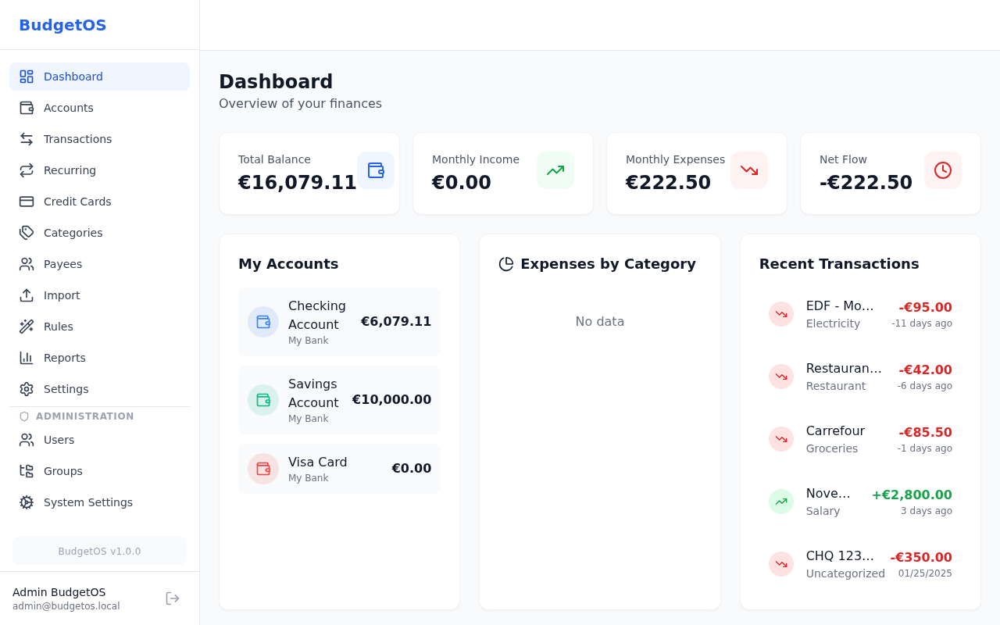
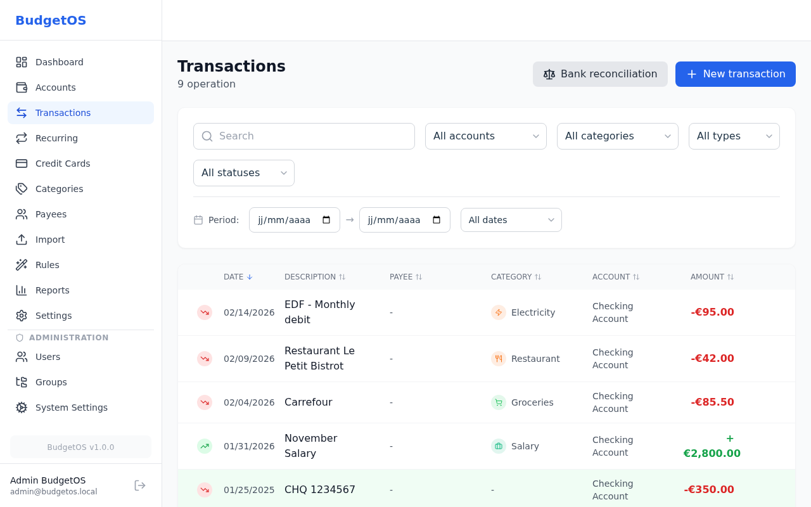
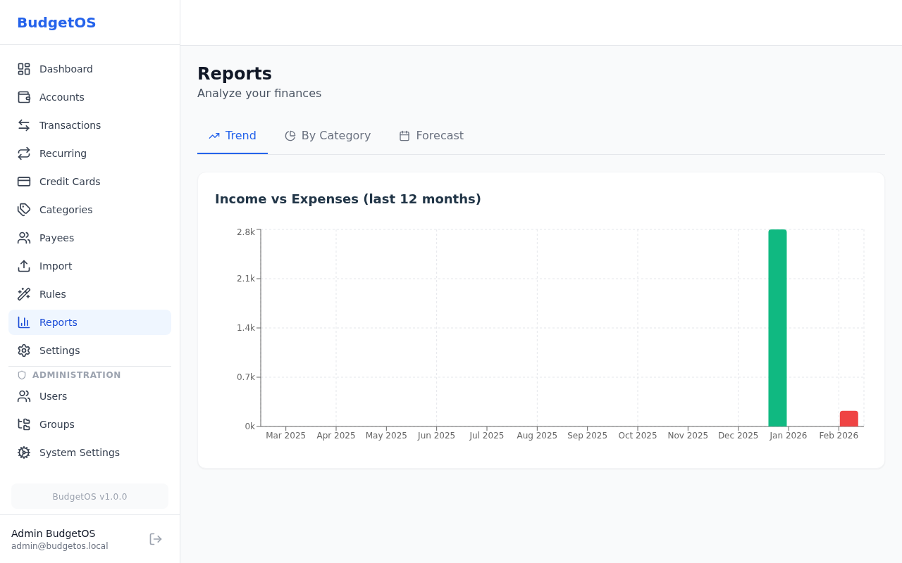
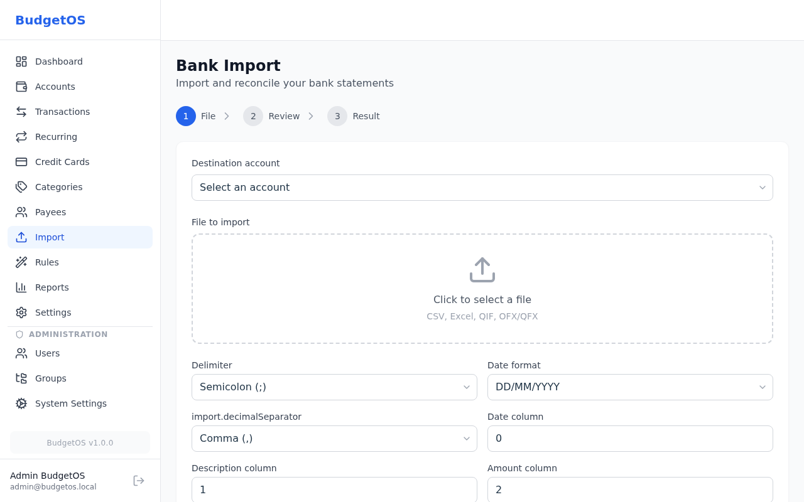
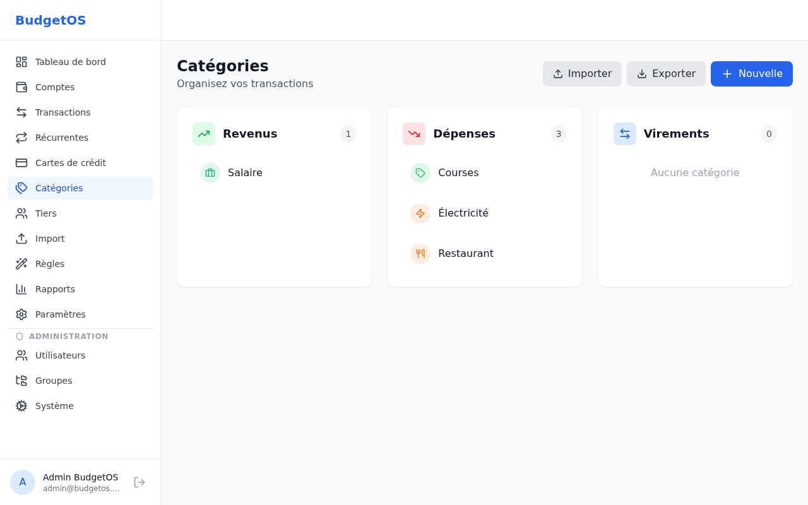

<div align="center">

# BudgetOS

**Self-hosted personal finance management for individuals and families**

[](https://hub.docker.com/r/ppcm/budgetos)
[](https://nodejs.org/)
[](https://www.sqlite.org/)
[](https://www.postgresql.org/)
[](https://mariadb.org/)
[](#license)

</div>

---

## Supported Tags

- `1.0.0`, `1.0`, `1`, `latest`

## Quick Reference

- **Maintained by**: [PPCM](https://github.com/PPCM)
- **Where to get help**: [GitHub Issues](https://github.com/PPCM/BudgetOS/issues)
- **Where to file issues**: [GitHub Issues](https://github.com/PPCM/BudgetOS/issues)
- **Source**: [GitHub](https://github.com/PPCM/BudgetOS)
- **Supported architectures**: `amd64`, `arm64`

---

## What is BudgetOS?

BudgetOS is a self-hosted web application for managing personal finances. It provides a complete solution for tracking bank accounts, credit cards, transactions, and generating financial reports.



### Key Highlights

- **Multi-user support** with role-based access control
- **Multi-database** support (SQLite, PostgreSQL, MariaDB)
- **Bank import** from CSV, Excel, QIF, OFX/QFX files
- **Automatic categorization** with customizable rules
- **Financial reports** with trends, forecasts, and category breakdowns
- **Multilingual** interface (English, French, German, Spanish, Italian, Portuguese, Russian, Chinese)

---

## Features

### Core Finance
- **Bank Accounts** — Checking, savings, investment, and credit card accounts with color coding
- **Transactions** — Full CRUD with search, filters, sorting, date ranges, and expandable details
- **Credit Cards** — Immediate and deferred debit types with customizable billing cycles
- **Recurring Transactions** — Scheduled operations with multiple frequencies

### Import & Reconciliation
- **Bank Import** — CSV, Excel (.xlsx), QIF, OFX/QFX file support with smart column mapping
- **Auto-Reconciliation** — Duplicate detection and automatic matching
- **Manual Reconciliation** — Dedicated mode for reconciling against bank statements

### Organization
- **Categories** — Three-column layout (Income, Expenses, Transfers) with icons and colors
- **Payees** — Manage merchants and beneficiaries with logos and alias learning
- **Categorization Rules** — Automatic transaction classification

### Analytics
- **Dashboard** — Financial overview with balance summary and recent transactions
- **Trend Reports** — Income vs. expenses bar chart over 12 months
- **Category Reports** — Spending breakdown with donut chart
- **Forecast** — Cash flow projections at 30, 60, and 90 days

### Administration
- **Multi-User** — Role-based access control (Super Admin, Admin, User)
- **User Management** — Create, edit, suspend users
- **Group Management** — Organize users into groups
- **System Settings** — Public registration toggle, default group configuration

---

## Quick Start

### Using Docker (Recommended)

```bash
# Create data directory
mkdir -p budgetos-data

# Run with Docker
docker run -d \
  --name budgetos \
  -p 3000:3000 \
  -v $(pwd)/budgetos-data:/app/data \
  -e SESSION_SECRET=your-secret-key-change-me \
  ppcm/budgetos:latest
```

Open [http://localhost:3000](http://localhost:3000) and create your admin account.

### Using Docker Compose

Create a `docker-compose.yml` file:

```yaml
services:
  budgetos:
    image: ppcm/budgetos:latest
    container_name: budgetos
    ports:
      - "3000:3000"
    volumes:
      - ./data:/app/data
      - ./uploads:/app/uploads
      - ./logs:/app/logs
    environment:
      - SESSION_SECRET=your-secret-key-change-me
      - NODE_ENV=production
    restart: unless-stopped
```

Then run:

```bash
docker compose up -d
```

### Environment Variables

#### General

| Variable | Default | Description |
|----------|---------|-------------|
| `SESSION_SECRET` | — | **Required**. Secret key for session encryption |
| `NODE_ENV` | `production` | Environment mode |
| `PORT` | `3000` | HTTP port |
| `HOST` | `0.0.0.0` | Bind address |
| `COOKIE_SECURE` | `false` | Set to `true` behind HTTPS proxy |

#### Database

| Variable | Default | Description |
|----------|---------|-------------|
| `DB_TYPE` | `sqlite` | Database: `sqlite`, `postgres`, or `mysql` |
| `DB_PATH` | `./data/budgetos.db` | SQLite file path (when `DB_TYPE=sqlite`) |

#### PostgreSQL (when `DB_TYPE=postgres`)

| Variable | Default | Description |
|----------|---------|-------------|
| `POSTGRES_HOST` | `localhost` | PostgreSQL host |
| `POSTGRES_PORT` | `5432` | PostgreSQL port |
| `POSTGRES_DB` | `budgetos` | Database name |
| `POSTGRES_USER` | `budgetos` | Database user |
| `POSTGRES_PASSWORD` | — | Database password |

#### MariaDB / MySQL (when `DB_TYPE=mysql`)

| Variable | Default | Description |
|----------|---------|-------------|
| `MYSQL_HOST` | `localhost` | MySQL/MariaDB host |
| `MYSQL_PORT` | `3306` | MySQL/MariaDB port |
| `MYSQL_DB` | `budgetos` | Database name |
| `MYSQL_USER` | `budgetos` | Database user |
| `MYSQL_PASSWORD` | — | Database password |

### Demo Data

To start with sample data for testing:

```bash
docker exec budgetos npm run db:seed
```

This creates:
- Admin account: `admin@budgetos.local` / `Admin123!`
- Sample accounts, categories, and transactions

---

## Screenshots

| Transactions | Reports |
|:-:|:-:|
|  |  |

| Bank Import | Categories |
|:-:|:-:|
|  |  |

> See all screenshots in the [User Guide](doc/user-guide.md).

---

## Documentation

| Document | Description |
|----------|-------------|
| [User Guide](doc/user-guide.md) | Complete guide for end users with screenshots |
| [Admin Guide](doc/admin-guide.md) | Installation, configuration, user management |

---

## Database Support

BudgetOS supports three database backends via [Knex.js](https://knexjs.org/):

| Database | Best for | Docker Compose Example |
|----------|----------|------------------------|
| **SQLite** | Single-user, simple setup | Default (no config needed) |
| **PostgreSQL** | Production, multi-user | See [Admin Guide](doc/admin-guide.md#postgresql) |
| **MariaDB** | Production, multi-user | See [Admin Guide](doc/admin-guide.md#mariadb--mysql) |

---

## Volumes

| Path | Purpose |
|------|---------|
| `/app/data` | SQLite database file (`budgetos.db`). Not needed when using PostgreSQL or MariaDB |
| `/app/uploads` | Temporary storage for bank import files (CSV, Excel, QIF, OFX/QFX) |
| `/app/logs` | Application logs (`budgetos.log`) |

---

## License

[PolyForm Noncommercial 1.0.0](LICENSE)
