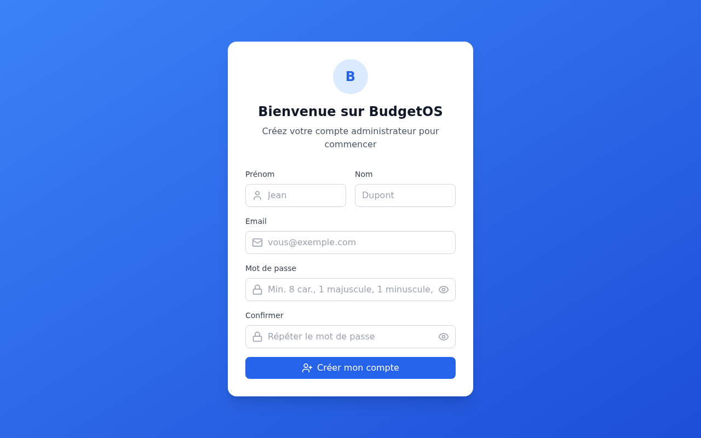
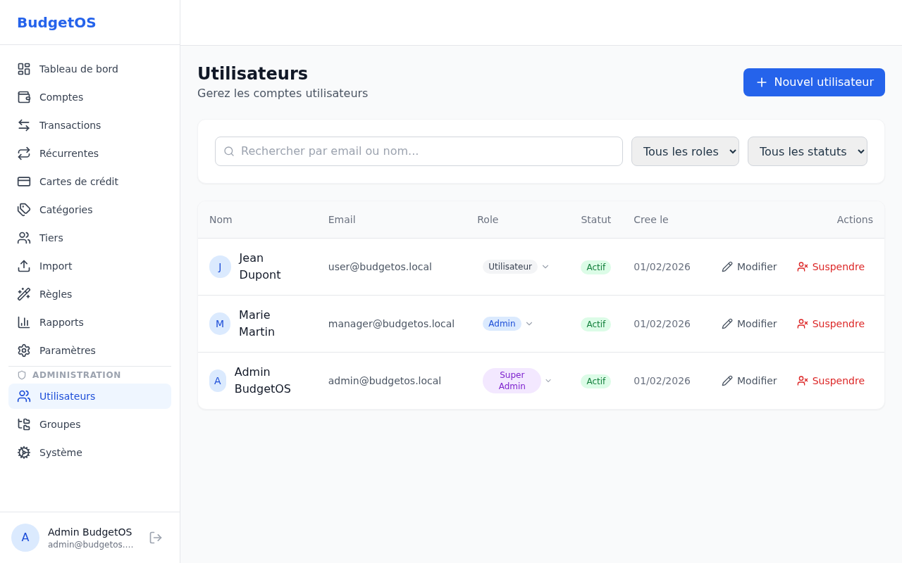
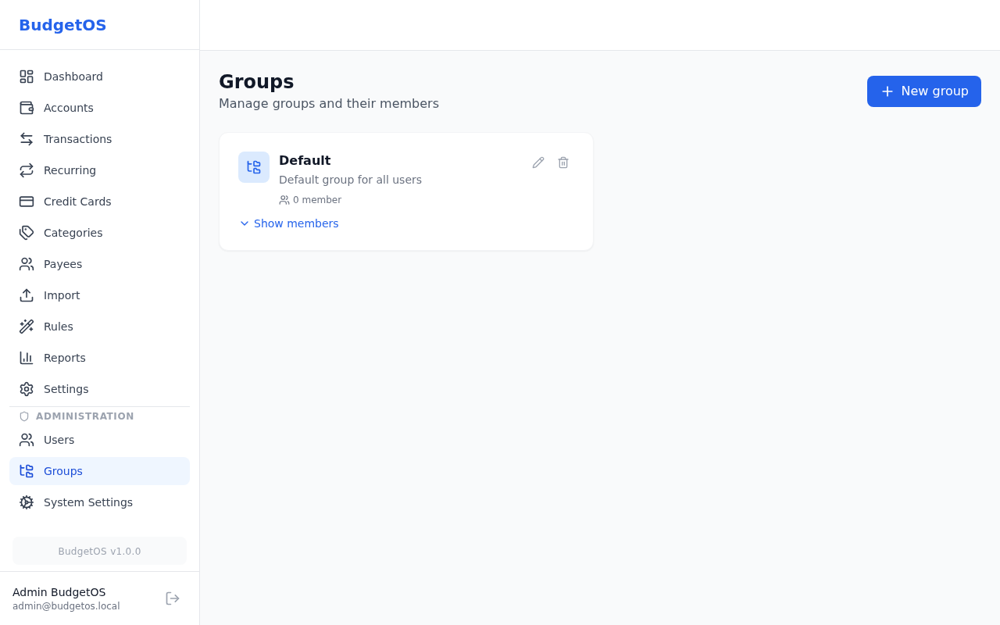
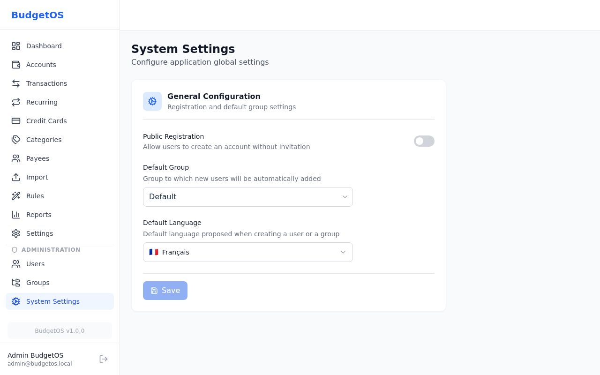

# BudgetOS Admin Guide

Installation, configuration, and administration reference for BudgetOS.

---

## Table of Contents

1. [Requirements](#1-requirements)
2. [Installation](#2-installation)
3. [Configuration](#3-configuration)
4. [Database Setup](#4-database-setup)
5. [First Launch / Bootstrap](#5-first-launch--bootstrap)
6. [User Management](#6-user-management)
7. [Group Management](#7-group-management)
8. [System Settings](#8-system-settings)
9. [CLI Reference](#9-cli-reference)
10. [Testing](#10-testing)
11. [Security](#11-security)

---

## 1. Requirements

### Docker Installation

| Requirement | Version |
|-------------|---------|
| **Docker** | >= 20.10 |
| **Docker Compose** | >= 2.0 |

### Manual Installation

| Requirement | Version |
|-------------|---------|
| **Node.js** | >= 18.0.0 |
| **npm** | >= 9.0.0 |
| **Git** | Any recent version |

---

## 2. Installation

### Option A: Docker (Recommended)

Docker is the easiest way to deploy BudgetOS. The image includes everything needed to run the application.

#### Quick Start with SQLite

```bash
docker run -d \
  --name budgetos \
  -p 3000:3000 \
  -v budgetos-data:/app/data \
  -v budgetos-uploads:/app/uploads \
  -v budgetos-logs:/app/logs \
  -e SESSION_SECRET=your-secret-key-change-me \
  ppcm/budgetos:latest
```

#### Docker Compose with SQLite

Create a `docker-compose.yml` file:

```yaml
services:
  budgetos:
    image: ppcm/budgetos:latest
    container_name: budgetos
    ports:
      - "3000:3000"
    volumes:
      - ./data:/app/data
      - ./uploads:/app/uploads
      - ./logs:/app/logs
    environment:
      - SESSION_SECRET=your-secret-key-change-me
      - NODE_ENV=production
    restart: unless-stopped
```

Then run:

```bash
docker compose up -d
```

#### Docker Compose with PostgreSQL

```yaml
services:
  budgetos:
    image: ppcm/budgetos:latest
    container_name: budgetos
    ports:
      - "3000:3000"
    volumes:
      - ./uploads:/app/uploads
      - ./logs:/app/logs
    environment:
      - SESSION_SECRET=your-secret-key-change-me
      - NODE_ENV=production
      - DB_TYPE=postgres
      - POSTGRES_HOST=postgres
      - POSTGRES_PORT=5432
      - POSTGRES_DB=budgetos
      - POSTGRES_USER=budgetos
      - POSTGRES_PASSWORD=budgetos-password
    depends_on:
      postgres:
        condition: service_healthy
    restart: unless-stopped

  postgres:
    image: postgres:16-alpine
    container_name: budgetos-postgres
    volumes:
      - postgres-data:/var/lib/postgresql/data
    environment:
      - POSTGRES_DB=budgetos
      - POSTGRES_USER=budgetos
      - POSTGRES_PASSWORD=budgetos-password
    healthcheck:
      test: ["CMD-SHELL", "pg_isready -U budgetos -d budgetos"]
      interval: 5s
      timeout: 5s
      retries: 5
    restart: unless-stopped

volumes:
  postgres-data:
```

#### Docker Compose with MariaDB

```yaml
services:
  budgetos:
    image: ppcm/budgetos:latest
    container_name: budgetos
    ports:
      - "3000:3000"
    volumes:
      - ./uploads:/app/uploads
      - ./logs:/app/logs
    environment:
      - SESSION_SECRET=your-secret-key-change-me
      - NODE_ENV=production
      - DB_TYPE=mysql
      - MYSQL_HOST=mariadb
      - MYSQL_PORT=3306
      - MYSQL_DB=budgetos
      - MYSQL_USER=budgetos
      - MYSQL_PASSWORD=budgetos-password
    depends_on:
      mariadb:
        condition: service_healthy
    restart: unless-stopped

  mariadb:
    image: mariadb:11
    container_name: budgetos-mariadb
    volumes:
      - mariadb-data:/var/lib/mysql
    environment:
      - MARIADB_DATABASE=budgetos
      - MARIADB_USER=budgetos
      - MARIADB_PASSWORD=budgetos-password
      - MARIADB_ROOT_PASSWORD=root-password
    healthcheck:
      test: ["CMD", "healthcheck.sh", "--connect", "--innodb_initialized"]
      interval: 5s
      timeout: 5s
      retries: 5
    restart: unless-stopped

volumes:
  mariadb-data:
```

#### Docker Environment Variables

| Variable | Default | Description |
|----------|---------|-------------|
| `SESSION_SECRET` | — | **Required**. Secret key for session encryption |
| `NODE_ENV` | `production` | Environment mode |
| `PORT` | `3000` | HTTP port |
| `HOST` | `0.0.0.0` | Bind address |
| `COOKIE_SECURE` | `false` | Set to `true` behind HTTPS proxy |
| `DB_TYPE` | `sqlite` | Database: `sqlite`, `postgres`, or `mysql` |
| `DB_PATH` | `./data/budgetos.db` | SQLite file path |
| `POSTGRES_HOST` | `localhost` | PostgreSQL host |
| `POSTGRES_PORT` | `5432` | PostgreSQL port |
| `POSTGRES_DB` | `budgetos` | PostgreSQL database name |
| `POSTGRES_USER` | `budgetos` | PostgreSQL user |
| `POSTGRES_PASSWORD` | — | PostgreSQL password |
| `MYSQL_HOST` | `localhost` | MariaDB/MySQL host |
| `MYSQL_PORT` | `3306` | MariaDB/MySQL port |
| `MYSQL_DB` | `budgetos` | MariaDB/MySQL database name |
| `MYSQL_USER` | `budgetos` | MariaDB/MySQL user |
| `MYSQL_PASSWORD` | — | MariaDB/MySQL password |

#### Docker Volumes

| Path | Purpose |
|------|---------|
| `/app/data` | SQLite database file |
| `/app/uploads` | User-uploaded files |
| `/app/logs` | Application logs |

#### Seed Demo Data (Docker)

```bash
docker exec budgetos npm run db:seed
```

---

### Option B: Manual Installation (GitHub)

For development or when Docker is not available.

```bash
# Clone the repository
git clone https://github.com/PPCM/BudgetOS.git
cd BudgetOS

# Install dependencies
npm install

# Copy environment configuration
cp .env.example .env

# Edit .env and set SESSION_SECRET
nano .env

# Run database migrations
npm run db:migrate

# (Optional) Seed demo data
npm run db:seed

# Build frontend and start server
./budgetos.sh build
```

The application is now accessible at `http://localhost:3000`.

---

### Production Recommendations

For production environments:

1. Set `NODE_ENV=production`
2. Use PostgreSQL or MariaDB instead of SQLite for multi-user setups
3. Set a strong, random `SESSION_SECRET` (at least 32 characters)
4. Set up a reverse proxy (nginx/Traefik) with HTTPS
5. Set `COOKIE_SECURE=true` when behind HTTPS
6. Regular backups of database and uploads

---

## 3. Configuration

All configuration is managed through the `.env` file at the project root.

### Server

| Variable | Default | Description |
|----------|---------|-------------|
| `NODE_ENV` | `development` | Environment mode (`development`, `production`) |
| `PORT` | `3000` | HTTP port |
| `HOST` | `0.0.0.0` | Bind address |

### Session

| Variable | Default | Description |
|----------|---------|-------------|
| `SESSION_SECRET` | — | **Required**. Secret key for session encryption |
| `SESSION_MAX_AGE` | `86400000` | Session duration in ms (default: 24h) |

### Database

| Variable | Default | Description |
|----------|---------|-------------|
| `DB_TYPE` | `sqlite` | Database engine: `sqlite`, `postgres`, or `mysql` |
| `DB_PATH` | `./data/budgetos.db` | SQLite file path |

### PostgreSQL

| Variable | Default | Description |
|----------|---------|-------------|
| `POSTGRES_HOST` | `localhost` | PostgreSQL host |
| `POSTGRES_PORT` | `5432` | PostgreSQL port |
| `POSTGRES_DB` | `budgetos` | Database name |
| `POSTGRES_USER` | `budgetos` | Database user |
| `POSTGRES_PASSWORD` | — | Database password |

### MariaDB / MySQL

| Variable | Default | Description |
|----------|---------|-------------|
| `MYSQL_HOST` | `localhost` | MySQL/MariaDB host |
| `MYSQL_PORT` | `3306` | MySQL/MariaDB port |
| `MYSQL_DB` | `budgetos` | Database name |
| `MYSQL_USER` | `budgetos` | Database user |
| `MYSQL_PASSWORD` | — | Database password |

### Security

| Variable | Default | Description |
|----------|---------|-------------|
| `BCRYPT_ROUNDS` | `12` | Password hashing cost factor |
| `RATE_LIMIT_WINDOW_MS` | `900000` | Rate limit window (15 min) |
| `RATE_LIMIT_MAX_REQUESTS` | `100` | Max requests per window |

### Application

| Variable | Default | Description |
|----------|---------|-------------|
| `DEFAULT_LOCALE` | `fr` | Default interface language |
| `DEFAULT_CURRENCY` | `EUR` | Default currency |
| `UPLOAD_MAX_SIZE` | `10485760` | Max upload size in bytes (10 MB) |
| `UPLOAD_PATH` | `./uploads` | Upload storage directory |
| `LOG_LEVEL` | `debug` | Logging level (`error`, `warn`, `info`, `debug`) |

---

## 4. Database Setup

### SQLite (Default)

SQLite requires no additional setup. The database file is created automatically at the path specified by `DB_PATH`.

```bash
# Ensure the data directory exists
mkdir -p data

# Run migrations
npm run db:migrate
```

### PostgreSQL

#### Option A: Docker (Recommended for Development)

```bash
# Start PostgreSQL container
docker compose -f docker-db/docker-compose.postgres.yml up -d

# Create the database (if not auto-created)
docker exec budgetos-postgres psql -U budgetos -d postgres \
  -c "CREATE DATABASE budgetos OWNER budgetos;"
```

#### Option B: Native Installation

```bash
# Create user and database
sudo -u postgres createuser budgetos
sudo -u postgres createdb -O budgetos budgetos
sudo -u postgres psql -c "ALTER USER budgetos WITH PASSWORD 'your-password';"
```

Update `.env`:

```env
DB_TYPE=postgres
POSTGRES_HOST=localhost
POSTGRES_PORT=5432
POSTGRES_DB=budgetos
POSTGRES_USER=budgetos
POSTGRES_PASSWORD=your-password
```

Then run migrations:

```bash
npm run db:migrate
```

### MariaDB / MySQL

#### Option A: Docker (Recommended for Development)

```bash
# Start MariaDB container
docker compose -f docker-db/docker-compose.mariadb.yml up -d

# Create the database (if not auto-created)
docker exec budgetos-mariadb mariadb -uroot -pbudgetos_root \
  -e "CREATE DATABASE IF NOT EXISTS budgetos; GRANT ALL PRIVILEGES ON budgetos.* TO 'budgetos'@'%';"
```

#### Option B: Native Installation

```sql
CREATE DATABASE budgetos CHARACTER SET utf8mb4 COLLATE utf8mb4_unicode_ci;
CREATE USER 'budgetos'@'localhost' IDENTIFIED BY 'your-password';
GRANT ALL PRIVILEGES ON budgetos.* TO 'budgetos'@'localhost';
FLUSH PRIVILEGES;
```

Update `.env`:

```env
DB_TYPE=mysql
MYSQL_HOST=localhost
MYSQL_PORT=3306
MYSQL_DB=budgetos
MYSQL_USER=budgetos
MYSQL_PASSWORD=your-password
```

Then run migrations:

```bash
npm run db:migrate
```

---

## 5. First Launch / Bootstrap

When BudgetOS starts with an empty database (no users), it enters **bootstrap mode**:

1. All routes redirect to `/register`
2. The registration page shows "Welcome to BudgetOS"
3. The first user account is automatically assigned the **super_admin** role
4. After registration, the application operates normally



### Demo Data

To populate the database with sample data for testing:

```bash
npm run db:seed
```

This creates:
- A super admin account (`admin@budgetos.local` / `Admin123!`)
- Demo users (Jean Dupont, Marie Martin)
- Sample accounts, categories, transactions, and recurring transactions
- A default user group

---

## 6. User Management

Accessible from **Administration > Users** (requires Admin or Super Admin role).



### Roles

| Role | Permissions |
|------|-------------|
| **User** | Manage own accounts, transactions, categories, payees, rules |
| **Admin** | Everything User can do + manage other users in their group |
| **Super Admin** | Full access including system settings, all users, all groups |

### Actions

| Action | Description |
|--------|-------------|
| **Create** | Click "New user" to create an account with email, name, password, and role |
| **Edit** | Modify user details and change role |
| **Suspend** | Temporarily disable a user account (prevents login) |
| **Change Role** | Click the role badge to cycle through available roles |

### Filters

- **Search** — Filter by email or name
- **Role** — Filter by Super Admin, Admin, or User
- **Status** — Filter by Active or Suspended

---

## 7. Group Management

Accessible from **Administration > Groups** (requires Super Admin role).



### Creating a Group

1. Click **New group**
2. Enter a **name** and optional **description**
3. Click **Save**

### Managing Members

1. Click **View members** on a group card
2. Add or remove users from the group

### Deleting a Group

Click **Delete** on a group card. Users in the group are not deleted — they are simply removed from the group.

---

## 8. System Settings

Accessible from **Administration > System** (requires Super Admin role).



### General Configuration

| Setting | Description |
|---------|-------------|
| **Public Registration** | Toggle to allow or prevent self-service account creation |
| **Default Group** | Group to which new users are automatically added upon registration |

---

## 9. CLI Reference

BudgetOS includes a management script for common operations.

```bash
./budgetos.sh <command>
```

| Command | Description |
|---------|-------------|
| `start` | Start the server in background |
| `stop` | Graceful shutdown |
| `restart` | Stop then start |
| `status` | Show server status (PID, port) |
| `build` | Build frontend (Vite) and restart server |
| `reset` | Delete SQLite database and re-seed |
| `logs [n]` | Show last n lines of log (default: 50) |
| `logs:follow` | Follow logs in real-time (`tail -f`) |
| `help` | Show help |

### Files

| File | Purpose |
|------|---------|
| `data/budgetos.pid` | Server PID file |
| `data/budgetos.log` | Server log file |

For the full CLI documentation, see [budgetos-cli.md](budgetos-cli.md).

---

## 10. Testing

### Quick Reference

```bash
# Unit tests (backend)
npm test

# Integration tests (SQLite in-memory)
npm run test:integration

# Unit + integration
npm run test:all

# E2E browser tests (Playwright)
npm run test:e2e

# Full suite across all 3 databases
npm run test:global
```

### Multi-Database Testing

To test against PostgreSQL and MariaDB:

```bash
# Start test database containers
docker compose -f docker-db/docker-compose.mariadb.yml up -d
docker compose -f docker-db/docker-compose.postgres.yml up -d

# Create test databases
docker exec budgetos-mariadb mariadb -uroot -pbudgetos_root \
  -e "CREATE DATABASE IF NOT EXISTS budgetos_test; GRANT ALL PRIVILEGES ON budgetos_test.* TO 'budgetos'@'%';"

docker exec budgetos-postgres psql -U budgetos -d postgres \
  -c "CREATE DATABASE budgetos_test OWNER budgetos;"

# Run integration tests on specific database
TEST_DB_CLIENT=mysql2 MYSQL_DB=budgetos_test npm run test:integration
TEST_DB_CLIENT=pg POSTGRES_DB=budgetos_test npm run test:integration
```

### Global Test Suite

```bash
npm run test:global
```

This runs all tests across all three databases. **Warning**: the SQLite database is automatically deleted at the end, so the application starts in bootstrap mode afterward. Either:
- Run `npm run db:seed` to restore demo data
- Register a new admin account through the UI

### E2E Tests

```bash
# Start test databases
docker compose -f docker-db/docker-compose.e2e.yml up -d --wait

# Run on all databases
npm run test:e2e:all-dbs

# Run on a specific database
npm run test:e2e:sqlite
npm run test:e2e:postgres
npm run test:e2e:mysql

# Stop containers
docker compose -f docker-db/docker-compose.e2e.yml down
```

---

## 11. Security

### Authentication

- Passwords are hashed with **bcrypt** (configurable rounds via `BCRYPT_ROUNDS`)
- Sessions are stored server-side with **express-session**
- Session cookies are `httpOnly` and `secure` in production
- Session duration is configurable via `SESSION_MAX_AGE`

### Protection Mechanisms

| Mechanism | Implementation |
|-----------|---------------|
| **CSRF** | Token-based CSRF protection on all state-changing requests |
| **Rate Limiting** | Configurable request limits per IP address |
| **Security Headers** | Helmet.js sets CSP, HSTS, X-Frame-Options, etc. |
| **Input Validation** | All inputs validated with Zod schemas before processing |
| **Data Isolation** | Users can only access their own data (enforced at query level) |
| **SQL Injection** | Prevented by Knex.js parameterized queries |

### Recommendations

1. **Always change** `SESSION_SECRET` from the default value
2. Use **HTTPS** in production (configure via reverse proxy)
3. Set `NODE_ENV=production` to enable secure cookies
4. Keep Node.js and dependencies up to date
5. Use PostgreSQL or MariaDB for production (file-level locking in SQLite can be limiting)
6. Set `RATE_LIMIT_MAX_REQUESTS` appropriately for your expected traffic
7. Regularly review user accounts and suspend unused ones

---

*For user-facing documentation, see the [User Guide](user-guide.md).*
