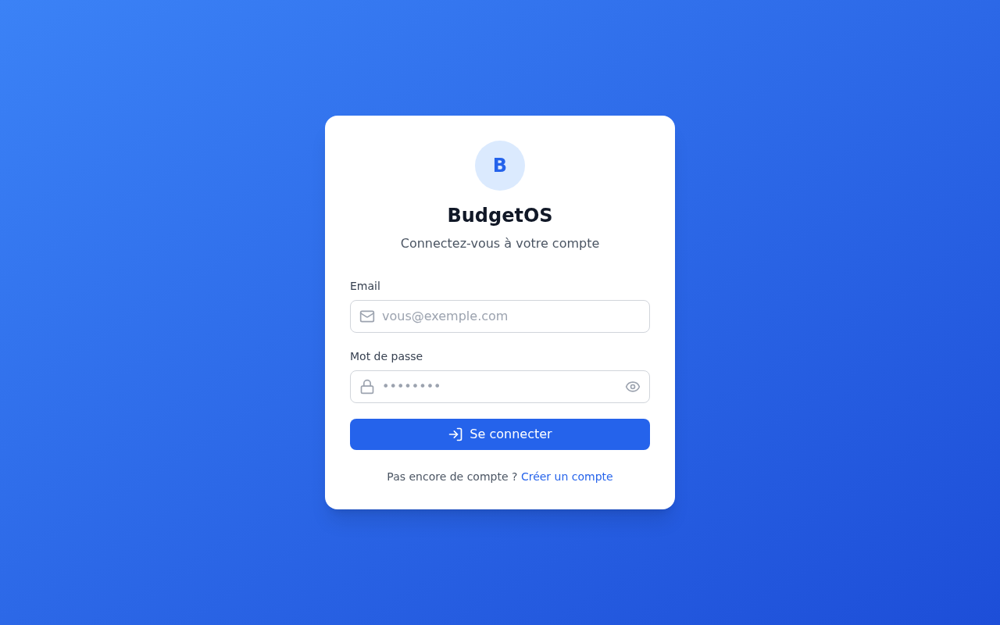
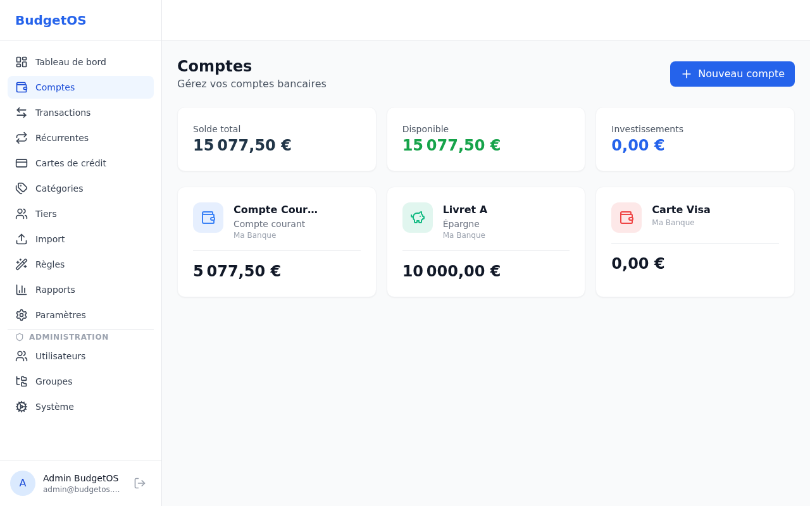
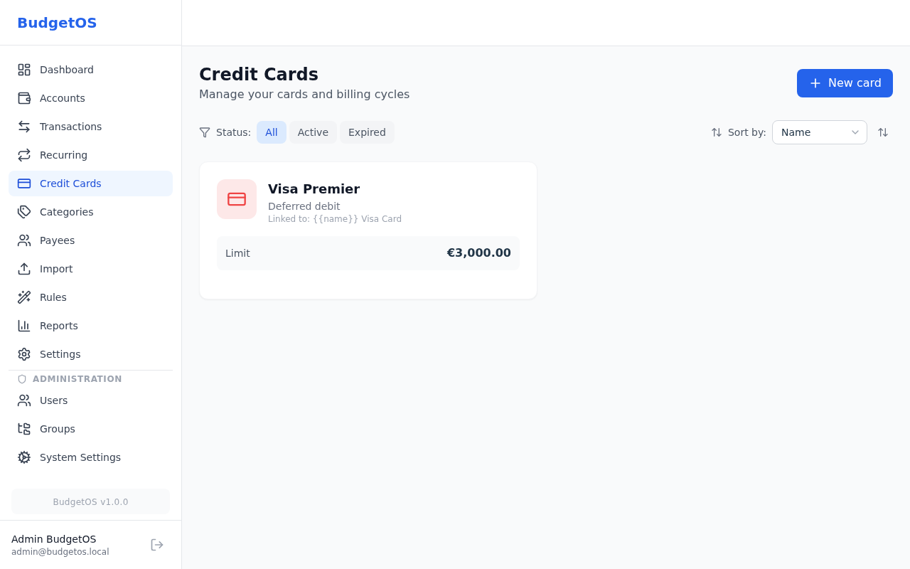
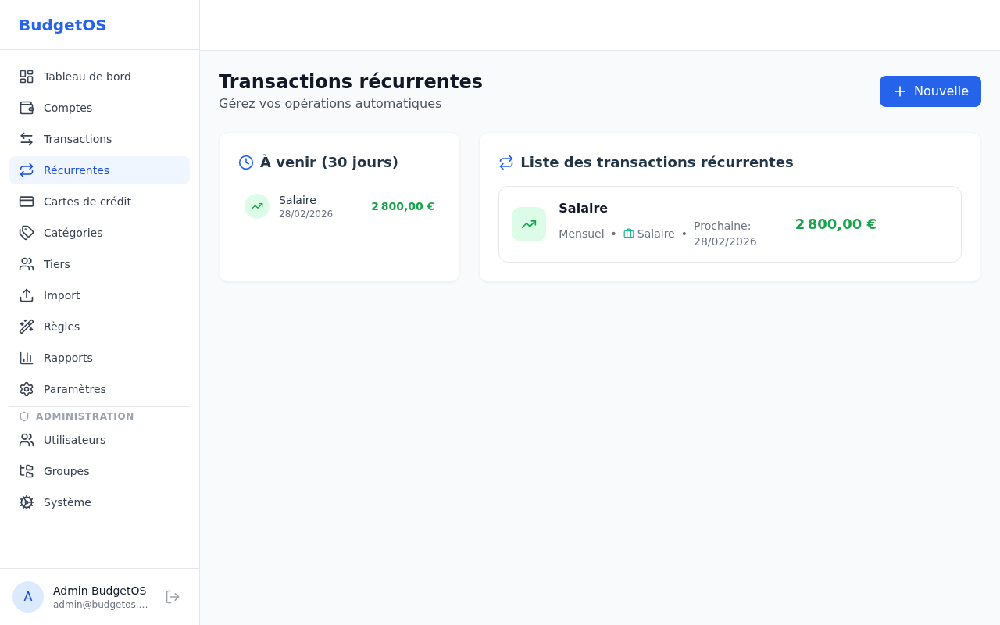
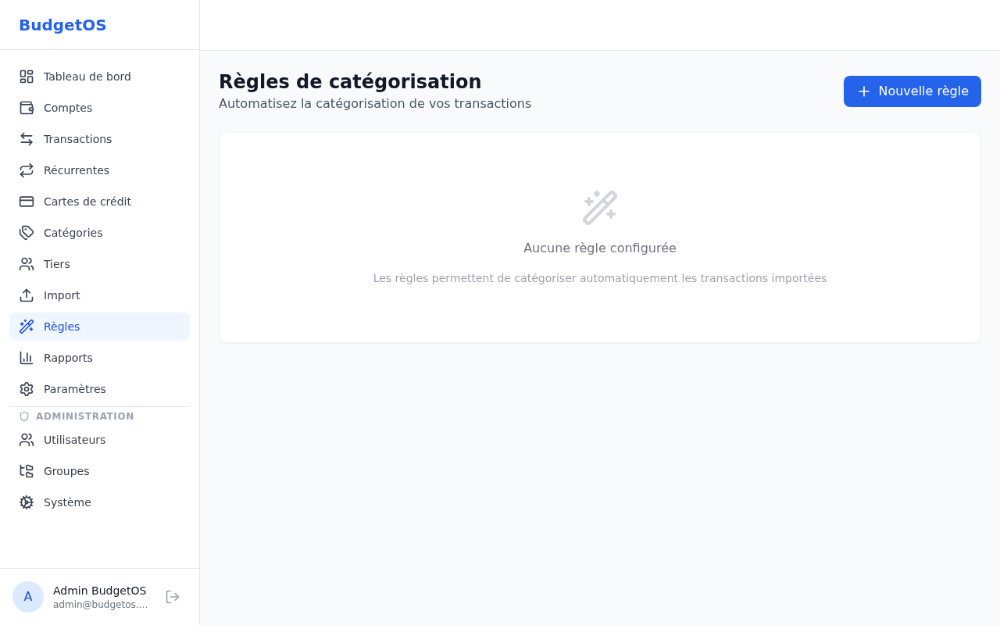
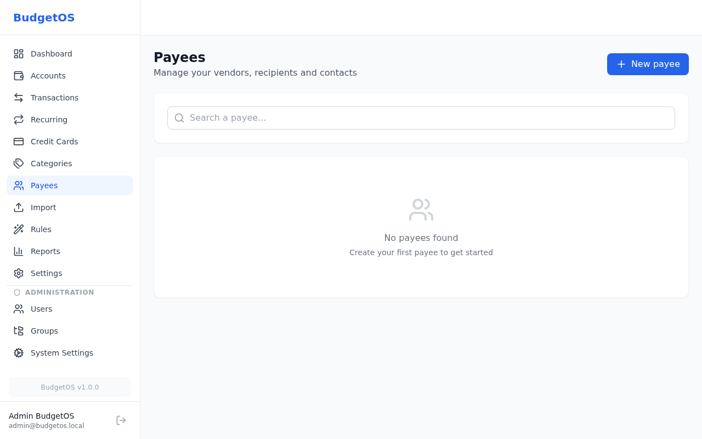
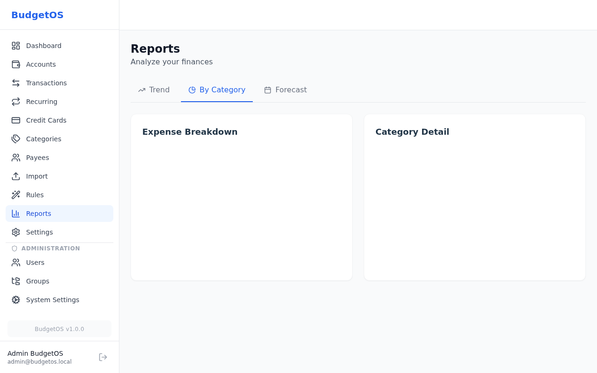
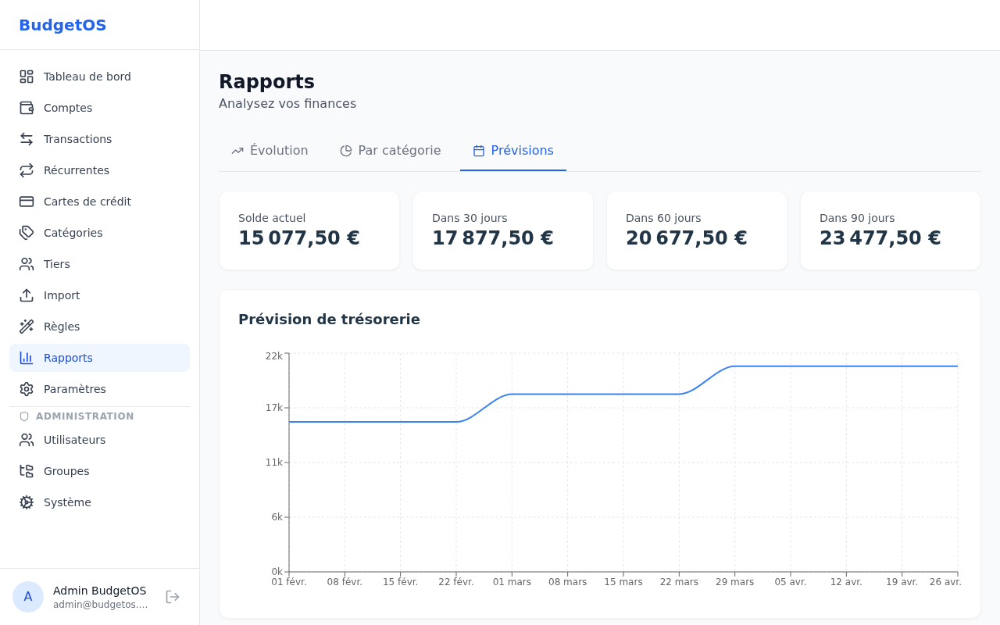
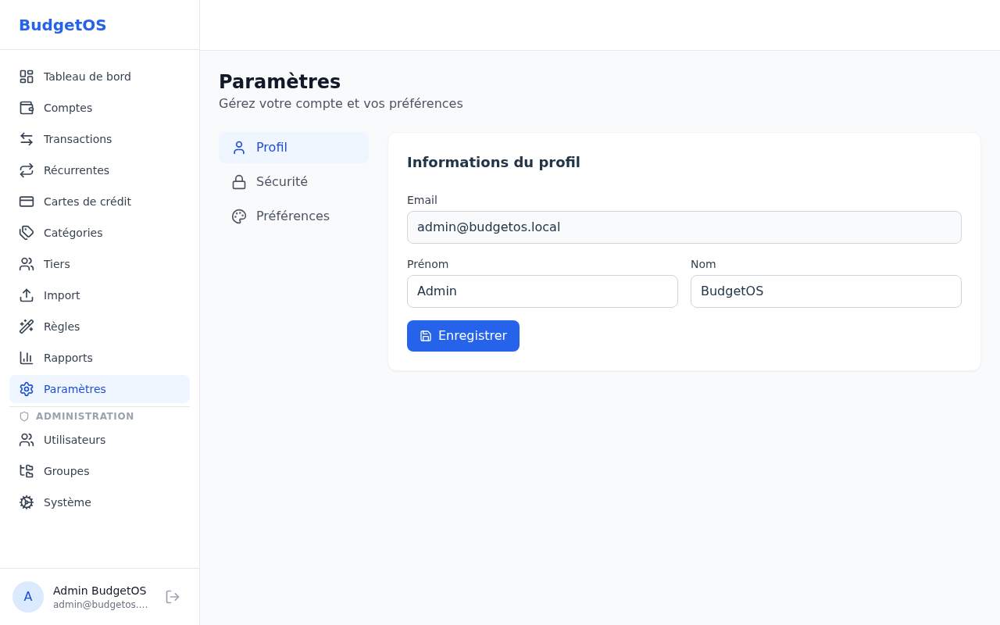

# BudgetOS User Guide

A complete guide to managing your personal finances with BudgetOS.

---

## Table of Contents

1. [Getting Started](#1-getting-started)
2. [Dashboard](#2-dashboard)
3. [Bank Accounts](#3-bank-accounts)
4. [Transactions](#4-transactions)
5. [Credit Cards](#5-credit-cards)
6. [Bank Import](#6-bank-import)
7. [Recurring Transactions](#7-recurring-transactions)
8. [Categorization Rules](#8-categorization-rules)
9. [Categories](#9-categories)
10. [Payees](#10-payees)
11. [Reports](#11-reports)
12. [Settings](#12-settings)

---

## 1. Getting Started

### First Launch (Bootstrap)

When BudgetOS starts with an empty database, you are automatically redirected to the setup page to create your first administrator account.

Fill in your name, email, and password (minimum 8 characters, at least 1 uppercase, 1 lowercase, and 1 digit), then click **Create my account**.

### Login

Once your account is created, you can log in at any time from the login page.

Enter your email and password, then click **Sign in**.

### Navigation

The sidebar on the left provides access to all sections:

- **Dashboard** — Financial overview
- **Accounts** — Bank account management
- **Transactions** — All transactions
- **Recurring** — Scheduled transactions
- **Credit Cards** — Card management
- **Categories** — Transaction categories
- **Payees** — Merchants and beneficiaries
- **Import** — Bank file import
- **Rules** — Auto-categorization rules
- **Reports** — Charts and analytics
- **Settings** — Profile and preferences

Users with **Admin** or **Super Admin** roles also see an **Administration** section with Users, Groups, and System settings.

---

## 2. Dashboard

The dashboard provides a bird's-eye view of your finances.

### Summary Cards

At the top, four cards display key figures:

| Card | Description |
|------|-------------|
| **Total Balance** | Sum of all account balances |
| **Month Income** | Total income for the current month |
| **Month Expenses** | Total expenses for the current month |
| **Net Flow** | Income minus expenses for the current month |

### My Accounts

A list of all your bank accounts with their current balance, institution name, and account type.

### Expenses by Category

A donut chart showing spending distribution across categories for the current month.

### Recent Transactions

The last transactions across all accounts, showing description, category, amount, and relative date.

---

## 3. Bank Accounts

Manage all your bank accounts from the Accounts page.

### Account Types

| Type | Description |
|------|-------------|
| **Checking** | Day-to-day transaction account |
| **Savings** | Savings and interest-bearing accounts |
| **Credit Card** | Account linked to a credit card |
| **Investment** | Investment and brokerage accounts |

### Summary Cards

Three cards at the top show:
- **Total Balance** — Sum of all accounts
- **Available** — Balance of checking + savings accounts
- **Investments** — Balance of investment accounts

### Creating an Account

1. Click **New account**
2. Fill in the form:
   - **Name** — Account name (e.g., "Main Checking")
   - **Type** — Select from the dropdown
   - **Institution** — Bank or institution name
   - **Initial Balance** — Starting balance
   - **Color** — Optional color for visual identification
3. Click **Save**

### Editing and Deleting

Each account card has **Edit** and **Delete** buttons. Deleting an account removes all associated transactions.

---

## 4. Transactions

The transactions page is the core of BudgetOS, providing a full view of all financial operations.

### Filters and Search

The toolbar provides multiple filtering options:

| Filter | Options |
|--------|---------|
| **Search** | Free-text search across descriptions |
| **Account** | Filter by specific account |
| **Category** | Filter by category |
| **Type** | Income, Expenses, Transfers |
| **Status** | Reconciled, Not reconciled |
| **Date Range** | Custom start/end dates |
| **Quick Dates** | Current week, 7 days, current month, 30 days, current year, 365 days |

### Creating a Transaction

1. Click **New**
2. Fill in:
   - **Date** — Transaction date
   - **Description** — What the transaction is for
   - **Amount** — Positive for income, negative for expenses
   - **Account** — Target account
   - **Category** — Transaction category
   - **Payee** — Merchant or beneficiary (optional)
   - **Check Number** — For check payments (optional)
   - **Credit Card** — If paid by credit card (optional)
   - **Notes** — Additional details (optional)
3. Click **Save**

### Transaction Details

Click on a transaction row to expand it and see all details including notes, check number, and reconciliation status.

### Reconciliation Mode

Click **Reconciliation** to enter bank reconciliation mode. This allows you to mark transactions as reconciled against your bank statement. See [Bank Reconciliation](bank-reconciliation.md) for details.

### Editing and Deleting

Each transaction row has edit (pencil) and delete (trash) action buttons on the right side.

---

## 5. Credit Cards

Manage credit cards with support for immediate and deferred debit types.

### Card Types

| Type | Description |
|------|-------------|
| **Immediate Debit** | Transactions are debited immediately from the linked account |
| **Deferred Debit** | Transactions are grouped and debited on the billing cycle closing date |

### Creating a Card

1. Click **New card**
2. Fill in:
   - **Name** — Card name (e.g., "Visa Premier")
   - **Type** — Immediate or Deferred debit
   - **Linked Account** — Bank account associated with this card
   - **Credit Limit** — Maximum spending limit
   - **Expiration Date** — Card expiry
   - **Billing Day** — Day of month when billing cycle closes (deferred only)
3. Click **Save**

### Filters

- **Status** — All, Active, Expired
- **Sort by** — Name, Expiration date
- **Order** — Ascending, Descending

### Billing Cycles

For deferred debit cards, BudgetOS automatically tracks billing cycles. Each cycle shows the total amount to be debited on the closing date.

---

## 6. Bank Import

Import transactions from your bank's export files.

### Supported Formats

| Format | Extension | Description |
|--------|-----------|-------------|
| **CSV** | .csv | Comma/semicolon-separated values |
| **Excel** | .xlsx | Microsoft Excel spreadsheets |
| **QIF** | .qif | Quicken Interchange Format |
| **OFX/QFX** | .ofx, .qfx | Open Financial Exchange |

### Import Process (3 Steps)

#### Step 1 — File Upload

1. Select the **destination account**
2. Click the upload area or drag and drop your file
3. Configure parsing options:
   - **Delimiter** — Semicolon, comma, or tab (CSV only)
   - **Date Format** — DD/MM/YYYY, MM/DD/YYYY, or YYYY-MM-DD
   - **Decimal Separator** — Comma or period
   - **Column Mapping** — Date, Description, and Amount column indices
4. Click **Analyze**

#### Step 2 — Review

BudgetOS analyzes the file and presents:
- **New transactions** — Transactions that will be imported
- **Duplicates** — Transactions that already exist (automatically excluded)
- **Category suggestions** — Based on existing rules and learning

Review the list and adjust categories if needed, then click **Import**.

#### Step 3 — Result

A summary showing:
- Number of transactions imported
- Number of duplicates skipped
- Number of transactions auto-categorized

---

## 7. Recurring Transactions

Set up automatic recurring transactions for regular bills and income.

### Upcoming (30 Days)

At the top, a preview shows transactions scheduled for the next 30 days.

### Creating a Recurring Transaction

1. Click **New**
2. Fill in:
   - **Description** — Transaction description
   - **Amount** — Transaction amount
   - **Account** — Target account
   - **Category** — Transaction category
   - **Frequency** — Daily, Weekly, Monthly, or Yearly
   - **Start Date** — When the recurrence begins
   - **End Date** — When it stops (optional)
3. Click **Save**

### Frequencies

| Frequency | Description |
|-----------|-------------|
| **Daily** | Every day |
| **Weekly** | Same day each week |
| **Monthly** | Same day each month |
| **Yearly** | Same day each year |

### Managing Recurring Transactions

Each entry shows the frequency, associated category, next occurrence date, and amount. Use the edit and delete buttons to modify or remove.

---

## 8. Categorization Rules

Automate transaction categorization during import.

### How Rules Work

Rules are applied to imported transactions based on conditions you define. When a transaction matches a rule's conditions, the specified category is automatically assigned.

### Creating a Rule

1. Click **New rule**
2. Define conditions:
   - **Field** — Which transaction field to check (description, amount, etc.)
   - **Operator** — Contains, equals, starts with, ends with, etc.
   - **Value** — The value to match against
3. Define actions:
   - **Category** — The category to assign
   - **Payee** — Optionally assign a payee
4. Click **Save**

### Rule Priority

Rules are evaluated in order. The first matching rule is applied. You can reorder rules to control priority.

---

## 9. Categories

Organize your transactions with customizable categories.

### Category Groups

Categories are organized into three columns:

| Group | Purpose |
|-------|---------|
| **Income** | Salary, investments, refunds, etc. |
| **Expenses** | Bills, groceries, entertainment, etc. |
| **Transfers** | Transfers between your own accounts |

### Creating a Category

1. Click **New**
2. Fill in:
   - **Name** — Category name
   - **Type** — Income, Expense, or Transfer
   - **Icon** — Choose from available icons
   - **Color** — Pick a color for visual identification
3. Click **Save**

### Import / Export

- **Export** — Download your categories as a JSON file for backup or sharing
- **Import** — Upload a JSON file to restore or import categories from another instance

---

## 10. Payees

Manage your merchants, suppliers, and beneficiaries.

### Creating a Payee

1. Click **New payee**
2. Fill in:
   - **Name** — Payee name
   - **Logo URL** — Optional URL to a logo image
   - **Default Category** — Automatically assigned when this payee is selected
3. Click **Save**

### Search

Use the search bar to filter payees by name.

### Alias Learning

When you import transactions and assign them to payees, BudgetOS learns the bank's description variations (aliases). Future imports will automatically match these aliases to the correct payee.

### Reassignment

When deleting a payee, you can reassign all their transactions to a different payee.

---

## 11. Reports

Analyze your finances with interactive charts and reports.

### Trend Report

A bar chart showing **Income vs. Expenses** over the last 12 months. Hover over any bar to see the exact amounts. This report helps identify spending patterns and seasonal variations.

### Category Report

Two views:
- **Donut Chart** — Visual breakdown of spending by category
- **Detail Table** — Amounts and percentages per category

### Forecast

A line chart projecting your balance forward based on:
- Current account balances
- Scheduled recurring transactions
- Historical spending patterns

Projections are shown at **30, 60, and 90 days**.

---

## 12. Settings

Manage your profile, security, and preferences.

### Profile Tab

- **Email** — Your login email (read-only)
- **First Name** — Your first name
- **Last Name** — Your last name

### Security Tab

- **Current Password** — Required to change password
- **New Password** — Must meet complexity requirements
- **Confirm Password** — Repeat the new password

### Preferences Tab

- **Language** — Interface language (French, English)
- **Currency** — Default currency for display
- **Timezone** — Your local timezone
- **Date Format** — How dates are displayed

---

## Tips

- **Keyboard shortcuts**: Use `Tab` to navigate between fields in forms
- **Quick filters**: Use the date presets (current week, 30 days, etc.) for fast filtering
- **Reconciliation**: Regularly reconcile your transactions to keep your accounts in sync with bank statements
- **Rules**: Set up categorization rules early to save time on future imports
- **Categories**: Export your categories after setup to have a backup

---

*For installation and administration, see the [Admin Guide](admin-guide.md).*
